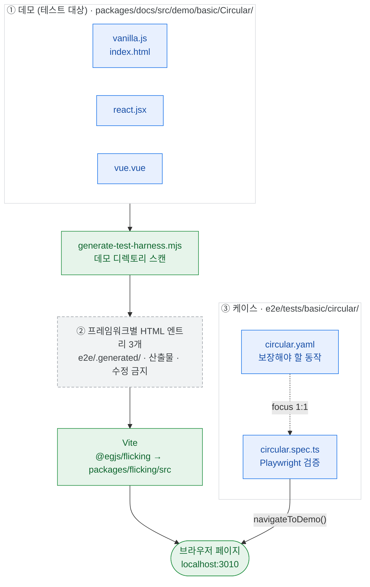

# E2E 케이스 채우기 프로그램

팀원이 E2E 케이스를 하나씩 맡아 채워 나가는 작업의 **운영 방식과 작성 규칙**을 정의한다. Flicking의 E2E는 docs 데모를 그대로 테스트 대상으로 쓰는 구조라, 규칙을 모르면 내 변경이 남의 케이스를 깨뜨린다. 이 문서는 그 규칙을 다룬다.

- 하네스 구조·헬퍼·스펙 포맷 등 **레퍼런스** → [E2E_TEST_GUIDE.md](./E2E_TEST_GUIDE.md)
- 담당자·주차·진행 상태 등 **현황** → GitHub 트래킹 이슈

현재: 46 케이스 / 453 테스트 / 약 52초. `run-test.yml`의 `e2e` job으로 push·PR마다 실행된다.

## 목적

1. 팀 전체가 E2E 기반(데모–스펙–테스트 3중 구조)을 이해한다
2. Flicking이 무엇을 보장해야 하는지 각자 정의해 보고, 리뷰에서 함께 맞춘다
3. 그 결과가 이후 리팩터링·릴리즈의 안전망으로 남는다

## 운영 방식

- **1인 1케이스**, 1~2주에 1건. 동시에 두 케이스를 잡지 않는다.
- 착수 시 트래킹 이슈에 코멘트를 남기고 테이블의 담당자·상태를 갱신한다.
- 브랜치 `test/e2e-{id}` → PR 제목 `test(e2e): {category}/{id} 케이스 보강`. **1 PR = 1 케이스.**
- 작업 범위는 스펙(YAML) + 테스트. 
- 데모가 기능을 제대로 보여주지 못한다고 보이면 이슈로 공유해서 논의 후에 진행한다. (데모를 보완 혹은 재작성할지 등 여부)
- 무엇을 검증할지 판단이 서지 않으면 초안 상태로 PR을 올리고 리뷰에서 함께 정한다. 기준은 케이스를 쌓아 가며 만든다.

## 이 레포에서 E2E가 도는 방식

별도 픽스처를 만들지 않는다. **문서 사이트의 데모가 그대로 테스트 대상이다.** 아래는 `basic/circular` 케이스를 예로 든 구조다.



파랑 = 사람이 작성 · 회색 점선 = 자동 생성(수정 금지) · 초록 = 실행 도구

| 작성하는 파일 | 위치 | 왜 필요한가 |
|--------------|------|------------|
| 데모 3종 + `index.html` | `packages/docs/src/demo/{Category}/{Name}/` | 문서 사이트에 노출되는 예제이자 E2E의 테스트 대상. 하네스가 이 디렉토리를 스캔한다 |
| `{id}.yaml` | `e2e/tests/{category}/{id}/` | 이 데모가 보장해야 할 동작을 `focus`에 선언. 테스트의 설계 문서 |
| `{id}.spec.ts` | `e2e/tests/{category}/{id}/` | `focus` 항목을 실제 브라우저에서 검증 |

케이스를 맡으면 **③만 작성**한다. ①은 논의 후에만 손대고, ②는 건드리지 않는다.

### Flicking 인스턴스에 접근하는 원리

하네스가 생성 HTML에 `Flicking.prototype.init` 패치 스크립트를 심는다. init이 끝난 인스턴스가 `window.__flickingInstances`에 순서대로 push된다. 여기서 세 가지가 따라온다.

- 배열 순서는 **init 완료 순서**다. DOM 순서와 다를 수 있다.
- `autoInit: false` 인스턴스는 `init()`이 호출되기 전까지 배열에 **없다**.
- 그래서 모든 테스트는 `waitForFlickingReady(page)`로 최소 1개 등록을 기다린 뒤 시작한다.

## 작성 규칙

1. **3종 세트는 같은 PR에서 함께 움직인다.** 데모를 고치면 그 케이스의 스펙·테스트도 같은 PR에서 고친다. (→ [E2E_TEST_GUIDE.md § 데모 변경 시 E2E 동반 수정](./E2E_TEST_GUIDE.md#데모-변경-시-e2e-동반-수정))
2. **데모는 3 프레임워크를 모두 수정한다.** `vanilla.js` / `react.jsx` / `vue.vue` 중 하나만 고치면 나머지 두 프레임워크의 테스트가 깨진다. `index.html`은 vanilla 전용이다.
3. **`.generated/`는 산출물이다.** 직접 수정하지 않는다. `pnpm dev`와 Playwright의 `webServer`가 실행 시 자동 재생성한다.
4. **네이밍이 곧 연결이다.** 데모 디렉토리는 PascalCase(`basic/Circular`), 스펙 id는 kebab-case(`basic/circular`). 스펙의 `demo:` 값과 테스트의 `navigateToDemo(page, framework, "basic", "Circular")` 인자가 어긋나면 다른 데모를 테스트하게 된다.
5. **viewport는 640×480 고정이다.** 크기·위치에 의존하는 단언은 이 기준으로 쓴다.
6. **패널 기본 스타일은 하네스가 주입한다.** `demo-defaults.ts`의 CSS가 `<style>`로 삽입되므로, 데모의 `styles.css`에 다시 정의할 필요가 없다.
7. **CI에서 매 PR마다 돈다.** 불안정한 테스트 하나가 팀 전체의 PR을 막는다. 고정 대기(`waitForTimeout`)보다 조건 대기(`expect.poll`, `waitForFunction`)를 쓴다.

## 케이스 진행 절차

**1. 착수 선언** — 트래킹 이슈에 코멘트, 테이블 갱신, 브랜치 생성

**2. 데모 확인** — 3 프레임워크를 눈으로 본다

```bash
cd packages/test-flicking/e2e
pnpm dev    # http://localhost:3010 → 갤러리에서 vanilla/react/vue 모두 확인
```

**3. 스펙(YAML) 갱신** — 이 데모가 보장해야 할 동작을 `focus`에 적는다. 검증이 불가능한 항목은 지우지 말고 `limitations`에 사유와 함께 남긴다. 포맷 → [E2E_TEST_GUIDE.md § 선언적 YAML 스펙](./E2E_TEST_GUIDE.md#선언적-yaml-스펙)

**4. 테스트 작성** — `focus` 항목과 `test()` 블록을 1:1로 맞추고, 각 테스트 위에 대응 focus를 주석으로 단다. 헬퍼·패턴 → [E2E_TEST_GUIDE.md § 테스트 작성법](./E2E_TEST_GUIDE.md#테스트-작성법)

```typescript
// focus: circular 인스턴스는 마지막 패널에서 다음으로 이동 시 첫 패널로 순환
test("마지막에서 처음으로 순환", async ({ page }) => { ... });
```

**5. 검증**

```bash
npx playwright test tests/{category}/{id} --headed          # 눈으로 확인
npx playwright test tests/{category}/{id} --repeat-each=3   # 불안정성 확인
pnpm test                                                    # 전체 통과
```

**6. PR + 이슈 갱신**

## 완료 기준

- [ ] `focus` 항목과 `test()` 블록이 1:1로 매핑되고 focus 주석이 있다
- [ ] 3 프레임워크에서 모두 통과한다
- [ ] `--repeat-each=3` 연속 통과 (한 번이라도 실패하면 완료가 아니다)
- [ ] `pnpm test:e2e` 전체 통과
- [ ] 데모를 수정했다면 3 프레임워크 파일을 모두 수정했다
- [ ] 검증 불가 항목이 `limitations`에 기록되어 있다

## 자주 겪는 실패

| 증상 | 원인 | 조치 |
|------|------|------|
| 404 또는 빈 페이지 | `navigateToDemo` 인자가 데모 디렉토리명과 불일치 | PascalCase 그대로 넘긴다 (`"Circular"`) |
| `waitForFlickingReady` 타임아웃 | 데모 초기화 실패, 또는 `autoInit: false` | `--headed`로 콘솔 확인. 수동 init 데모는 버튼 클릭 후 접근 |
| 새로 만든 데모가 안 보임 | `pnpm dev` 서버가 떠 있으면 Playwright가 그대로 재사용(`reuseExistingServer`)해 재생성하지 않음 | dev 서버를 껐다 켠다 |
| `__flickingInstances[1]`이 undefined | 아직 init되지 않은 인스턴스 | init을 트리거한 뒤 접근. 배열 순서는 init 완료 순서다 |
| 로컬은 통과, CI는 실패 | 고정 대기에 의존 | `expect.poll` / `waitForFunction`으로 교체 |

## 알려진 하네스 제약

구조상 검증이 어렵거나 불가능한 영역이다. 새로 발견하면 케이스 스펙의 `limitations`에 기록하고, 여러 케이스에 걸치면 이 표에 추가한다.

| 제약 | 영향받는 케이스 | 설명 |
|------|----------------|------|
| Vanilla `connectFlickingReactiveAPI` | progress-bar, pagination (advanced) | reactive subscribe가 DOM에 반영되지 않는 경우가 있다. Flicking API로 직접 조회하여 우회 |
| `needPanel` 이벤트 트리거 | infinite-scroll (vanilla/react) | `moveTo`/`next()` 호출 시 발생하지 않는 경우가 있다. Vue는 정상 |
| Vue wrapper prop 전달 | optimize-size-update, infinite-scroll | 일부 prop이 내부 Flicking에 전달되지 않는다 (`optimizeSizeUpdate`, `needPanelThreshold`) |
| 슬라이더 상호작용 | auto-resize, resize-debounce | `fill()` + `dispatchEvent("input")`은 실제 사용자 조작과 다르다 |
| 방향 전환 후 재초기화 | fullpage-scroll | destroy/recreate 시 `__flickingInstances` 재등록 타이밍 문제 |
| 브라우저 1종 | 전체 | chromium만 실행한다 |

`OptimizeSizeUpdate` 데모는 옵션 자체에 이슈가 있어 E2E 대상에서 보류 중이다. 이슈 해결 후 케이스를 신설한다.

## 참고 문서

| 문서 | 내용 |
|------|------|
| [E2E_TEST_GUIDE.md](./E2E_TEST_GUIDE.md) | 하네스 구조, 명령어, 스펙 포맷, 헬퍼 함수, 테스트 작성법 |
| [DEMO_GUIDE.md](./DEMO_GUIDE.md) | 데모 디렉토리 구조, 프레임워크별 코드 패턴 |
| [TEST_GUIDE.md](./TEST_GUIDE.md) | unit/plugins/cfc 테스트 스위트 |
