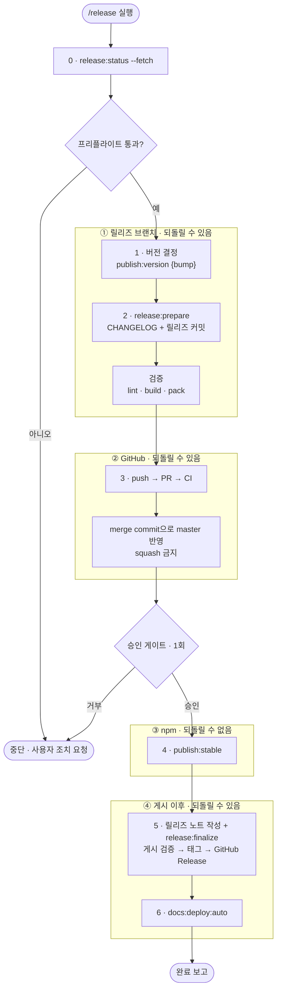
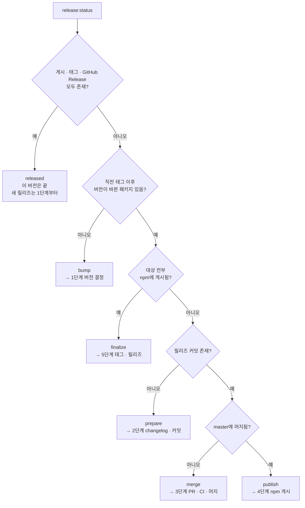

# 퍼블리시 & 버전 관리 가이드

## 릴리즈 브랜치 취합

여러 PR이 master를 타겟으로 열려 있을 때, 개별 PR을 master에 직접 머지하지 않고 **하나의 릴리즈 브랜치에 모아 검증한 뒤 master에 단일 반영**한다. 버전 범프와 changelog도 이 브랜치에 포함한다.

### 브랜치명 컨벤션

```
release/{scope}-{version}
```

- `scope`: 릴리즈를 주도하는 패키지 — `core` | `react` | `vue` | `plugins`
- `version`: 목표 버전
- 예: `release/core-4.16.2`

### 절차

1. master에서 릴리즈 브랜치 생성 (`git checkout -b release/core-4.16.2`)
2. 취합할 각 PR 브랜치를 `--no-ff`로 머지 (SHA 보존 — 원본 PR 자동 종료에 필요)
3. 버전을 변경하고 `pnpm release:prepare`로 changelog·릴리즈 커밋을 만든다
4. 릴리즈 브랜치에서 검증 (lint·빌드·pack, 필요 시 `/release-check`로 전체 스위트)
5. 릴리즈 브랜치 → master PR을 열고, 본문에 `Closes #A #B …`로 취합한 PR을 명시
6. PR CI 통과 후 **merge commit으로** master에 머지 → 취합된 PR들이 "Merged"로 자동 종료
7. 이후 아래 [배포 절차](#배포-절차)로 퍼블리시

> 취합한 PR을 **수동으로 close하지 않는다.** `Closes` + SHA 보존 머지(`--no-ff`)로 두면 master 머지 시 "Merged"로 자동 종료되어 이력이 깔끔하다. 수동 close는 "Closed"로 남아 병합 이력이 흐려진다.

> **릴리즈 PR에 squash 머지를 쓰지 않는다.** 릴리즈 커밋 SHA가 바뀌면 태그가 게시본과 다른 커밋을 가리키게 되고, 취합한 PR의 자동 종료도 깨진다.

## 배포 진행 원칙

### 순서: 머지 후 publish

되돌릴 수 없는 단계를 파이프라인 맨 뒤에 둔다.

```
버전 범프 → release:prepare → PR·CI → master 머지 → npm publish → release:finalize → docs 배포
```

- npm 버전 번호는 회수할 수 없고 git 커밋은 되돌릴 수 있다. 실패 비용이 싼 쪽을 먼저 실행한다.
- 게시된 tarball이 master에 실재하는 커밋과 1:1로 대응하므로 태그·릴리즈 노트의 대상이 명확해진다.
- 태그와 GitHub Release는 publish 성공 뒤에만 만든다. `release:finalize`가 npm 레지스트리를 조회해 이 순서를 강제한다.
- publish 단계에서 실패해도 아직 게시된 것이 없으므로 **같은 버전으로 재시도**한다. 일부만 게시됐다면 실패한 패키지만 같은 버전으로 다시 올린다 (게시된 버전은 재게시 불가).

정식 배포 스크립트(`publish:stable*`)는 pnpm의 git 검사를 켠 상태로 실행한다. 이 순서를 사람이 기억하지 않아도 되도록 스크립트가 막는다:

| 검사 | 위반 시 |
|------|---------|
| 작업 트리 clean | `ERR_PNPM_GIT_UNCLEAN` — 즉시 중단 |
| 현재 브랜치 == `publish-branch`(`.npmrc`에 `master` 명시) | 계속할지 확인 프롬프트, 비대화형이면 중단 |
| 원격 이력 동기 | `ERR_PNPM_GIT_NOT_LATEST` — 원격이 앞서 있으면 중단 |

- 로컬이 원격보다 **앞선**(미푸시) 경우는 pnpm이 잡지 않는다. `/release` 스킬이 publish 직전 `release:status`의 `pushed`로 막는다.
- 베타(`publish:beta*`)는 `--no-git-checks`를 유지한다. 릴리즈 브랜치에서 미커밋 버전 범프로 게시하므로 검사에 걸린다.

### 역할 분담

1. **npm 로그인 확인이 최우선 게이트.**
   - 어떤 배포 작업이든 시작 전에 `npm whoami`로 로그인 여부를 먼저 확인한다.
   - 로그인이 안 되어 있으면(**401**) **다른 배포 작업을 일절 진행하지 않고**, 사용자에게 `npm login`(별도 터미널)을 요청한다. 인증은 `~/.npmrc`에 저장되어 현재 세션에도 반영된다.
   - `npm whoami`로 로그인이 확인된 뒤에만 다음 단계로 넘어간다.
2. **사전 단계는 어시스턴트가 전부 완료한다.**
   - 버전 범프 → `release:prepare` → 빌드·`pnpm pack` 검증(래퍼가 올바른 코어 버전을 의존하는지) → PR 생성·CI 확인·master 머지까지 진행한다.
3. **publish는 사용자 확인 1회 후 어시스턴트가 실행한다.**
   - 게시 대상 패키지·버전·npm 계정·dist-tag를 제시하고 승인을 받는다. 승인 없이 실행하지 않는다.
   - **OTP(`--otp`)는 다루지 않는다.** 2FA는 로그인 단계에서 처리되며 `publish` 시 OTP 입력을 요구하지 않는다.
4. **태그·릴리즈·문서 배포는 승인 없이 이어서 진행한다.** 되돌릴 수 있는 단계다.

> 전체 파이프라인은 `/release` 스킬이 수행한다. 상태 판별·재개 규칙 포함 → `.claude/skills/release/SKILL.md`, [HARNESS_GUIDE.md](HARNESS_GUIDE.md)

## 빠른 시작

### 사전 준비 (최초 1회)

1. **npm 로그인** — `@egjs` scope에 publish 권한이 있는 계정으로 로그인
   ```bash
   npm login
   ```
2. **gh CLI 설치** — [GitHub CLI](https://cli.github.com/) 설치 후 인증. PR·CI 확인·GitHub Release에 모두 필요하다.
   ```bash
   brew install gh
   gh auth login
   ```
3. **정본 remote 확인** — 아래가 remote 이름을 출력하지 못하면 정본을 가리키는 remote를 추가한다.
   ```bash
   node config/release.js remote        # 예: origin | upstream
   git remote add upstream https://github.com/naver/egjs-flicking.git
   ```

### 배포 절차

**`/release` 스킬을 실행하면 아래 전 과정이 순서대로 진행된다.**



| 단계 | 명령 | 하는 일 |
|------|------|---------|
| 0 | `release:status --fetch` | 저장소·레지스트리 상태 관측, 재개 지점 산출 |
| 1 | `publish:version {bump}` | 코어 버전 수정 후 래퍼 동기화 (단독 배포는 해당 `package.json`만) |
| 2 | `release:prepare` | `pnpm install` + CHANGELOG + 릴리즈 커밋 |
| 3 | `gh pr create` → `gh pr merge --merge` | CI 통과 후 master 반영 |
| 4 | `publish:stable` | 승인 1회 후 npm 게시 |
| 5 | `release:notes` → `release:finalize` | Highlights 작성 후 게시 검증 → 태그 → GitHub Release |
| 6 | `docs:deploy:auto` | 문서 사이트 배포 |

- **③만 되돌릴 수 없다.** 그래서 사용자 승인 게이트도 ③ 바로 앞에 하나만 둔다.
- 게이트는 둘이다 — 0단계 관측값으로 판단하는 프리플라이트, publish 직전 승인. 그 외에는 멈추지 않는다.
- 프리플라이트에서 막는 것: npm 미로그인 · gh 미인증 · 더티 트리 · 미푸시 커밋 · 정본 remote 없음 · 정본 write 권한 없음.
- ④는 게시 이후지만 태그·릴리즈·문서는 다시 만들 수 있어, 실패하면 같은 명령을 재실행하면 된다.

시나리오별 명령어 → [배포 워크플로우](#배포-워크플로우)

### 중단과 재개

어느 단계에서 멈췄든 `/release`를 다시 실행하면 `release:status`가 저장소·레지스트리 상태를 관측해 재개 지점(`stage`)을 계산한다. "어디까지 했는지"를 사람이 기억할 필요가 없다.



- 코어만 게시되고 래퍼가 실패한 것처럼 **일부만 게시된 상태**는 `publish`로 남는다. 실패한 패키지만 같은 버전으로 다시 올린다.
- `finalize`는 게시되지 않은 버전에 태그를 만들지 않는다. 미게시면 중단하고 4단계로 돌려보낸다.
- `pushed`가 false인 채 `stage`가 `publish`면 릴리즈 커밋이 GitHub에 없는 상태다. 게시하지 않고 3단계로 돌아간다.

---

## 용어 정리

| 용어 | 의미 | 해당 명령어 |
|------|------|------------|
| **Publish** | npm에 패키지를 올리는 것 | `pnpm publish:*` |
| **Release** | changelog·커밋(prepare) + 태그·GitHub Release(finalize) | `pnpm release:prepare` / `pnpm release:finalize` |
| **Deploy** | 문서 사이트를 배포하는 것 | `pnpm docs:deploy:auto` |

## 패키지 의존 관계

```
@egjs/react-flicking  ──dependencies──→  @egjs/flicking (코어)
@egjs/vue3-flicking   ──dependencies──→  @egjs/flicking (코어)
@egjs/flicking-plugins ──peerDeps────→  @egjs/flicking (코어)
```

- **래퍼(react/vue)**: 코어의 thin bridge. `export * from "@egjs/flicking"`으로 코어 API를 전부 re-export하고, 프레임워크 라이프사이클 연결 코드만 자체 보유 (~300줄).
- **플러그인**: 코어와 독립적. peerDependencies로 코어를 요구하므로 별도 버전 관리.
- 래퍼끼리, 래퍼와 플러그인은 서로 의존하지 않음.

### workspace: 프로토콜

모노레포 내부의 패키지 간 의존성은 `workspace:~`로 선언한다.

```json
// packages/react-flicking/package.json
"dependencies": {
  "@egjs/flicking": "workspace:~"
}
```

- **개발 시**: 항상 로컬 패키지를 심링크로 연결 (버전 불일치 걱정 없음)
- **publish 시**: pnpm이 자동으로 `workspace:~` → `~4.16.0` 처럼 실제 버전으로 치환
- 수동으로 의존성 버전 문자열을 관리할 필요 없음

## 버전 정책

### 원칙

1. 각 패키지는 독자적으로 버전을 가진다.
2. 래퍼의 **major**는 코어의 major를 따른다.
3. 코어 버전이 올라가면 래퍼도 재배포한다 (소비자가 `npm install @egjs/react-flicking@latest`만으로 코어 변경분을 받을 수 있도록).
4. 래퍼는 독자적으로 버전이 앞설 수 있다 (프레임워크 호환성 수정 등).
5. 플러그인은 코어와 독립적으로 관리한다.
6. 루트 `package.json`의 version(`3.0.0`)은 **모노레포 자체 버전**이며 프로덕트 버전과 무관하다. 릴리즈·배포 대상이 아니고 코어 버전과 동기화하지 않는다.

### 코어 변경 시

| 코어 변경 | 래퍼 | 플러그인 | `publish:version` 인자 |
|-----------|------|---------|----------------------|
| **patch** (4.16.0 → 4.16.1) | patch +1 | 변경 없음 | `patch` |
| **minor** (4.16.0 → 4.17.0) | minor +1, patch 리셋 | 변경 없음 | `minor` |
| **major** (4.x → 5.0.0) | major 동기화, minor/patch 리셋 | major 업데이트 + peerDeps 수정 | `major` |
| **베타** | 수동 관리 | 수동 관리 | 사용 안 함 |

### 래퍼가 독자적으로 앞서있는 경우

래퍼가 코어보다 높은 minor를 가지고 있을 때, 코어 minor 업데이트가 발생하면 래퍼는 **자신의 minor +1**로 올라간다 (코어 minor로 내려가지 않음).

```
코어    4.16.0  →  4.16.0  →  4.17.0
react   4.16.0  →  4.17.0  →  4.18.0
                   (독자 수정)  (코어 minor → 래퍼 minor +1)
```

### 래퍼/플러그인 단독 변경

코어와 무관한 변경(프레임워크 호환성 수정, 플러그인 버그 수정 등)은 해당 패키지만 수동으로 버전을 올려 개별 배포한다. 단독 배포도 **머지 후 publish** 순서를 따른다 — 버전 정책만 다르고 절차는 같다.

```bash
# react-flicking만 패치 배포: version 수동 변경 → prepare → 머지 → publish → finalize
pnpm release:prepare --package react
```

전체 명령 흐름 → [래퍼/플러그인 단독 정식 배포](#래퍼플러그인-단독-정식-배포)

## 배포 명령어

### `publish:version`을 사용하는 경우

`publish:version`은 **코어 버전을 변경한 후 래퍼 버전을 정책에 따라 자동 동기화**하는 명령어다.

| 상황 | `publish:version` | 이유 |
|------|-------------------|------|
| 코어 정식 배포 (patch/minor/major) | **사용** | 래퍼도 코어 변경에 맞춰 재배포해야 함 |
| 베타 배포 | **사용 안 함** | 각 패키지 버전을 수동으로 관리 |
| 래퍼 단독 배포 | **사용 안 함** | 코어가 안 바뀌었으므로 동기화 불필요 |
| 플러그인 단독 배포 | **사용 안 함** | 플러그인은 독립적 버전 관리 |

### 구조

- `publish:version`은 정식 배포 시 코어 변경 후 래퍼 동기화 용도로만 사용한다. bump type을 반드시 지정해야 한다.
- `publish:stable`과 `publish:beta`는 빌드+배포만 담당한다 (버전 변경 없음).
- 베타 배포 시에는 각 패키지 버전을 수동으로 관리하고 개별 명령어로 배포한다.

> **`publish:version && publish:stable`을 이어 붙여 실행하지 않는다.** 정식 배포에서 `publish:stable`은 릴리즈 커밋이 master에 머지된 뒤에만 실행한다. → [순서: 머지 후 publish](#순서-머지-후-publish), [배포 워크플로우](#배포-워크플로우)

```bash
# 베타 배포 (각 패키지 버전 수동 변경 후 — 머지 없이 브랜치에서 게시)
pnpm publish:beta:flicking
pnpm publish:beta:react
```

### 명령어 레퍼런스

| 명령어 | 설명 |
|--------|------|
| `pnpm publish:version patch` | 코어 패치 업데이트 시 래퍼 동기화 |
| `pnpm publish:version minor` | 코어 마이너 업데이트 시 래퍼 동기화 |
| `pnpm publish:version major` | 코어 메이저 업데이트 시 래퍼 동기화 |
| `pnpm publish:build` | 전체 빌드 (단독 사용: 빌드 검증용) |
| `pnpm publish:stable` | 전체 빌드 + npm 퍼블리시 |
| `pnpm publish:stable:{pkg}` | 개별 빌드 + 퍼블리시 (flicking\|react\|vue\|plugins) |
| `pnpm publish:beta` | 전체 빌드 + npm 베타 퍼블리시 |
| `pnpm publish:beta:{pkg}` | 개별 빌드 + 베타 퍼블리시 |

- `publish:stable*`은 git 검사를 켠 채 실행된다(더티 트리·비 master·원격 미동기에서 중단). → [순서: 머지 후 publish](#순서-머지-후-publish)
- `publish:beta*`만 `--no-git-checks`를 쓴다.
### 릴리즈

`config/release.js`는 [머지 후 publish](#순서-머지-후-publish) 순서를 강제하기 위해 두 단계로 나뉜다.

| 명령어 | 실행 위치 | 설명 |
|--------|-----------|------|
| `pnpm release:status` | 어디서나 | 버전·태그·게시·릴리즈 상태와 재개 지점(`stage`)을 출력. `--json`으로 기계 판독 |
| `pnpm release:prepare` | 릴리즈 브랜치 | `pnpm install` + changelog + 릴리즈 커밋 (태그·push 없음) |
| `pnpm release:notes` | 어디서나 | 릴리즈 노트 초안 뼈대 생성 (`--out FILE`), CHANGELOG 섹션을 근거로 출력 |
| `pnpm release:finalize` | master (publish 후) | npm 게시 검증 → 태그 → push → GitHub Release |
| `node config/release.js remote` | 어디서나 | 정본(naver/egjs-flicking)을 가리키는 remote 이름 출력 |
| `pnpm test:config` | 어디서나 | `sync-version.js` / `release.js` 단위 테스트 |

공통 옵션: `--dry-run` · `--package {core|react|vue|plugins}` · `--skip-install` · `--allow-master` · `--notes-file FILE` · `--remote NAME` · `--branch NAME`

- `pnpm release`(인자 없음)는 사용법만 출력한다.
- `release:prepare`는 릴리즈 대상 경로(`CHANGELOG.md`, `pnpm-lock.yaml`, 공개 패키지 `package.json`)만 커밋한다. 작업 중인 다른 파일은 스테이징하지 않는다.
- `release:finalize`는 대상 패키지가 npm에 게시되어 있는지 먼저 확인하고, 미게시면 중단한다. 태그는 릴리즈 커밋 SHA에 붙인다.
- `--package`를 주면 래퍼·플러그인 단독 릴리즈로 동작한다. 태그·changelog 기준이 해당 패키지 태그(`@egjs/react-flicking@4.17.1`)가 된다.

태그 규칙:

- 코어 릴리즈는 bare 태그(`4.17.0`)와 버전이 바뀐 패키지 태그(`@egjs/flicking@4.17.0` 등)를 함께 만든다.
- 단독 릴리즈는 해당 패키지 태그만 만든다 (bare 태그는 코어 릴리즈 전용).
- 직전 태그 계산도 같은 기준으로 나뉜다 — 코어는 bare 태그 중 최신, 단독은 해당 패키지 태그 중 최신.
- 이미 존재하는 태그는 건너뛴다. `finalize` 재실행이 안전한 이유다.

`release:status`가 판별하는 환경 상태 (`--fetch`를 주면 정본 master를 먼저 받아온다):

| 필드 | 의미 |
|------|------|
| `clean` / `dirtyFiles` | 릴리즈와 무관한 미커밋 변경 |
| `pushed` / `unpushedCommits` / `upstream` | 현재 브랜치가 원격에 올라가 있는지 |
| `baseBehind` / `baseRef` | HEAD가 모르는 정본 master 커밋 수 (>0이면 브랜치 베이스가 낡음, `null`이면 fetch 전이라 판단 불가) |
| `canonicalRemote` / `canonicalPermission` | 정본을 가리키는 remote와 그 저장소에 대한 내 권한 |
| `canPushCanonical` | 정본에 write 권한이 있는지 (false면 머지·배포 권한 없음) |
| `isFork` / `pushRemote` / `prHead` | fork 클론인지, 브랜치를 push할 remote, PR head 표기(`{owner}:{branch}`) |
| `stage` / `nextStep` | 재개 지점, 실제로 다음에 실행할 것 |

> **fork 클론에서는** 브랜치를 `pushRemote`(fork)로 push하고 `gh pr create --repo naver/egjs-flicking --head {owner}:{branch}`로 PR을 만든다. `canPushCanonical`이 false면 머지·publish 권한이 없으므로 PR 생성까지만 진행하고 이후는 권한자가 이어받는다.

### 릴리즈 노트(GitHub Release) 작성

`release:finalize`가 `gh release create`를 실행해 [Releases](https://github.com/naver/egjs-flicking/releases) 항목을 만든다. 제목은 `{태그} Release ({릴리즈 커밋 날짜})` 형식으로 고정된다.

**기본 방침: Highlights를 직접 쓰고 자동 PR 목록을 결합한다.** 기존 릴리즈(4.16.0~4.16.4)가 모두 이 형태이고, 자동 생성만으로 만든 릴리즈는 없다.

```bash
# 1) 뼈대 생성 — Packages 표는 채워지고, 작성 근거로 CHANGELOG 섹션이 출력된다
pnpm release:notes --out /tmp/release-notes.md

# 2) Highlights를 채운 뒤 전달 (본문 위 = 직접 작성, 아래 = 자동 PR 목록)
pnpm release:finalize --notes-file /tmp/release-notes.md
```

- Highlights는 커밋 제목 나열이 아니라 **사용자 영향 서술**로 쓴다 — "무엇이 바뀌었나 — 왜 중요한가 (#PR)".
- breaking change·deprecate가 있으면 마이그레이션 방법을 함께 적고, 없으면 해당 섹션을 지운다.
- 초안 파일은 저장소 밖에 둔다. 커밋 대상이 아니다.
- `--notes-file` 없이 `finalize`를 실행하면 **CHANGELOG의 해당 버전 섹션이 본문으로 들어간다** (수동 실행용 안전망).

본문은 플래그에 따라 결정된다:

| 방식 | 본문 내용 | 직접 작성 |
|------|-----------|-----------|
| `--generate-notes` | GitHub이 자동 생성 — 직전 릴리즈 이후 머지된 **PR 제목 목록** + 기여자 + Full Changelog 링크 | 불필요 (단, PR 제목 나열뿐이라 빈약) |
| `--notes-file FILE` / `--notes "..."` | 파일/문자열에 **직접 작성한 내용** | 필요 |
| 둘 다 지정 | 직접 작성 내용(위) + 자동 PR 목록(아래) 결합 | 필요 |

**권장**: 하이라이트·breaking change·deprecate 안내 등은 자동 생성으로 표현되지 않으므로, 짧게라도 직접 작성한다.

```bash
# 이미 만든 릴리즈 노트 수정
gh release edit "4.17.0" --repo naver/egjs-flicking --notes-file /tmp/release-notes.md
```

> GitHub Release 본문은 다음 `pnpm docs:deploy:auto` 때 `fetch-releases.js`가 가져와 문서 사이트 `/releases`에 자동 게시한다. 즉 GitHub Release = 문서 사이트 릴리즈 노트이므로 블로그에 따로 쓸 필요가 없다. (상세 → `DOCS_GUIDE.md`)

## 배포 워크플로우

### 정식 배포

#### 코어 정식 배포 (minor 예시)

```bash
# 0. 상태 확인 — nextStep이 npm-login이면 npm login부터
#    clean·pushed·baseBehind·isFork·canPushCanonical도 함께 확인한다
pnpm -s release:status --json --fetch

# 1. 릴리즈 브랜치 — 정본 master 최신에서 만든다
REMOTE=$(node config/release.js remote)
git fetch $REMOTE master
git checkout -b release/core-4.18.0 $REMOTE/master

# 2. 코어 package.json version 수동 변경: 4.17.0 → 4.18.0
#    (플러그인도 함께 배포하려면 flicking-plugins version도 수동 변경)
#    래퍼 동기화 — publish:version minor 결과:
#      react-flicking  4.17.0 → 4.18.0 (minor +1)
#      vue3-flicking   4.17.0 → 4.18.0 (minor +1)
pnpm publish:version minor

# 3. changelog + 릴리즈 커밋 (내부에서 pnpm install 실행)
pnpm release:prepare

# 4. 배포 산출물 검증 (테스트는 PR CI가 담당)
pnpm lint && pnpm publish:build
pnpm --filter @egjs/react-flicking pack --pack-destination /tmp   # 코어 의존이 ~4.18.0인지 확인

# 5. PR → CI → master 머지 (squash 금지)
git push -u $REMOTE release/core-4.18.0        # push 없이 gh pr create를 실행하면 비대화형에서 실패한다
PR=$(gh pr create --repo naver/egjs-flicking --base master --head release/core-4.18.0 \
  --title "chore(release): Release 4.18.0" --body "취합한 PR: Closes #A #B")
gh pr checks "$PR" --watch
gh pr merge "$PR" --merge
git checkout master && git pull $REMOTE master

# 6. npm 게시 (사용자 확인 1회 후)
pnpm publish:stable

# 7. 태그 + push + GitHub Release
pnpm release:finalize

# 8. 문서 사이트 배포 (릴리즈 후 필수 — /releases·버전 표시 갱신)
pnpm docs:deploy:auto
```

patch·major는 2단계의 `publish:version` 인자만 달라진다. major는 플러그인 `peerDependencies`를 수동 수정한 뒤 `pnpm publish:stable:plugins`로 함께 올린다. → [코어 변경 시](#코어-변경-시)

#### 래퍼/플러그인 단독 정식 배포

코어가 바뀌지 않았으므로 `publish:version`을 쓰지 않고, 릴리즈 기준도 해당 패키지 태그가 된다.

```bash
# 1. 해당 package.json version만 수동 변경 후
git checkout -b release/react-4.17.1
pnpm release:prepare --package react

# 2. PR → CI → master 머지 후 게시
pnpm publish:stable:react

# 3. 태그·릴리즈 (@egjs/react-flicking@4.17.1 태그만 생성)
pnpm release:finalize --package react
pnpm docs:deploy:auto
```

### 베타 배포

베타에서는 `publish:version`을 사용하지 않는다. 각 패키지 버전을 수동으로 변경한 후 개별 배포한다.

**베타는 master 머지 대상이 아니다.** 릴리즈 브랜치에서 바로 게시하고, `release:prepare`·`release:finalize`를 쓰지 않는다 (changelog·태그·GitHub Release를 만들지 않는다).

#### 코어만 수정 → 코어만 베타 배포

```bash
# 1. 코어 버전 수동 변경: 4.16.0 → 4.17.0-beta.0
pnpm publish:beta:flicking
```

#### 래퍼만 수정 → 래퍼만 베타 배포

```bash
# 1. react-flicking 버전 수동 변경: 4.16.0 → 4.16.1-beta.0
pnpm publish:beta:react
```

#### 코어 수정 → 코어 + 래퍼 모두 베타 배포

```bash
# 1. 코어 버전 수동 변경: 4.16.0 → 4.17.0-beta.0
# 2. 래퍼 버전 수동 변경: 4.15.0 → 4.16.0-beta.0 (react, vue 각각)
# 3. 전체 배포
pnpm publish:beta
# 또는 개별 배포
pnpm publish:beta:flicking
pnpm publish:beta:react
pnpm publish:beta:vue
```

#### 코어 + 래퍼 모두 수정 → 둘 다 베타 배포

```bash
# 1. 코어 버전 수동 변경: 4.16.0 → 4.17.0-beta.0
# 2. 래퍼 버전 수동 변경: 4.15.0 → 4.16.0-beta.0
pnpm publish:beta
```

## 향후 계획

자체 스크립트(`config/sync-version.js`, `config/release.js`)는 과도기 도구다. [changesets](https://github.com/changesets/changesets)로 전환하면 아래처럼 대체할 수 있다.

| 현재 도구 | changesets 대체 |
|-----------|----------------|
| `sync-version.js` | `changeset version` |
| `release:prepare` (changelog + 릴리즈 커밋) | `changeset version` |
| `release:finalize` (태그 + GitHub Release) | `changeset tag` + `gh release create` |
| `publish:stable` | `changeset publish` |

전환 시 검토할 것 — changesets는 게시 순서를 강제하지 않으므로, [머지 후 publish](#순서-머지-후-publish) 보장과 재개 판단(`release:status`)을 어떻게 유지할지 함께 결정해야 한다.
